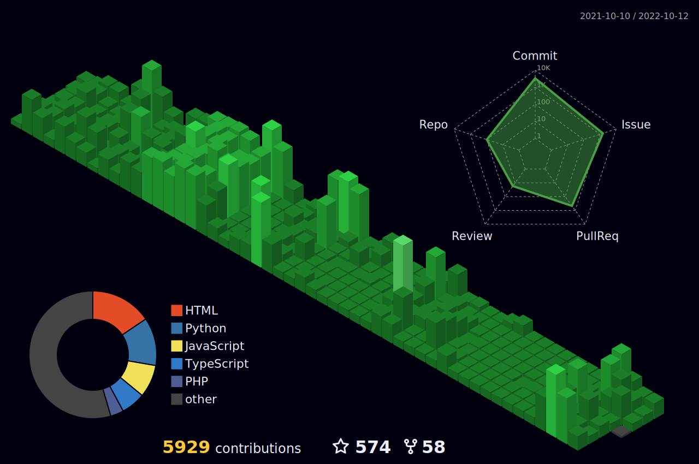

<!--**abhijeet007rocks8/abhijeet007rocks8** is a ✨ _special_ ✨ repository because its `README.md` (this file) appears on your GitHub profile.

Here are some ideas to get you started: 
 
- 🔭 I’m currently working on ... DSA
- 🌱 I’m currently learning ... React and Django
- 👯 I’m looking to collaborate on ... anything 
- 🤔 I’m looking for help with ... everything
- 💬 Ask me about ... 
- 📫 How to reach me: ...
- 😄 Pronouns: ... he/him
- ⚡ Fun fact: ...    
-->

<h1 align="center">Hi there 👋 I am  Abhijeet Chatterjee  </h1>

 
  Visitors count 
  

## **About Me:**
Frontend Developer [@Sloyd.ai](https://github.com/Sloydai) || Ex-Engineering Extern [@GitHub](https://github.com/github) || Web Lead [@GDSC VIT Bhopal](https://github.com/DSCVITBHOPAL) || Python Backend Developer  || Full-Stack Web Developer || Data Analyst 

<!--
## **TechStack:**

 
 
 
 
  
  
   
   
  
 
  
  
  
  
  
   
   
     
  
  
 
 

-->

	

	

	

<!--
# Contributions
<h4 align="center">Isometric view of contributions in the last year. Languages pie is based on recent commits</h4>

	

-->

# Technologies

### CI/CD

### Databases

### Frameworks, Platforms and Libraries

### Hosting/SaaS

### ORM
 <!--- TODO: Add shields.io SQLAlchemy badge -->

### Programming & Markdown, Styling Languages

### Version Control

### Other

<!--
# Metrics

	

-->

---

 <h2 align="center">📫 Reach out to me on</h2>
  

    &nbsp;&nbsp;&nbsp;&nbsp;
    &nbsp;&nbsp;&nbsp;&nbsp;
    &nbsp;&nbsp;&nbsp;&nbsp;
&nbsp;&nbsp;&nbsp;&nbsp;

